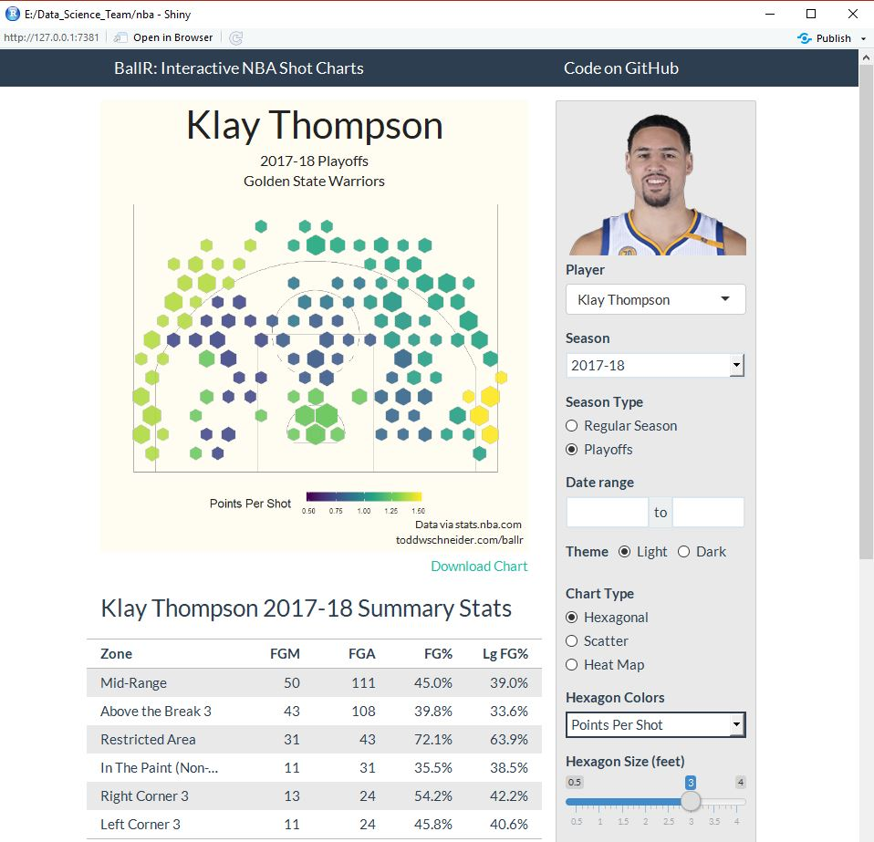

```{r setup, include=FALSE}
knitr::opts_chunk$set(echo = TRUE)
```


<br> 

### Big Picture 


* Students who already have some programming/software skill can learn R, a cool modern program, and create interative web sites with data visualizations
* Students with little or no skill with software can start, learning for example how to use spreadsheets, a fun and valuable tool for lots of things, including homework!
* Students with interest in things like art, leadership, or just be organized could help "team" projects too


### Fun stuff


* We will look at all sorts of "big" and "open" data, and explore generating visualizations with various tools. We can definately have some fun with apps like [this](http://toddwschneider.com/posts/ballr-interactive-nba-shot-charts-with-r-and-shiny/) made in R Shiny, looking at lots of data for every single NBA player, or even using R to make some simple games like [this](https://daattali.com/shiny/lightsout/).


```{r, out.width = "800px", echo = FALSE}
# All defaults
knitr::include_graphics("oddsEnds/both.JPG")

#

#   
```

<br>


* Another fun thing we could spend some time with [here](https://ryo-n7.github.io/2019-01-11-visualize-asian-cup/)

<br>


### Objectives

*  Develop "JS Team Data", a Data Science Team at John Sweet High School in Crockett, California
*  Introduce interested students to the "hot" field of Data Science
*  Learn together how to make web sites and other data-related resources that can have an impact and/or are just fun

<br> 

### Activities

*  The Team will decide together what tools (e.g. software) to use moving forward, and decide what web applications and/or other "products" to build based on interests and motivations of team members
* Core team focus will be on retrieving/collecting data, organizing and curating data, and analyzing and displaying data, BUT there would be some great team roles for other students/members like artists (design of pictures and logos), school leaders (suggesting directions for team projects), and others.
*  Eventually, the team could apply for some small consulting gigs, to learn more about coding in the "real world" and to build some team resources

<br> 

### Mentor or "Coach"
*  Team Mentor (Coach?), Michael Samuel, will introduce the Team to a suite of tools based on the free and open source R ecosystem, including tools for "data wrangling", making charts, and makin maps.
*  Michael will also introduce the use of GitHub as the repository for Team work, and to facilitate several other aspects of team collaboration
* A bit more about Michael can be found [here](http://dlab.berkeley.edu/people/dr-michael-samuel) or [here](https://www.linkedin.com/in/mcsamuel/), and a version of the main project on which he works can be found [here](https://cdph.ca.gov/communityburden).

<br> 

### Logistics

* Some logistics will need to be determined based on the schedules of interested students
* A tentative plan would be to meet one afternoon a week after school in the ??? room, and one afternoon a week "virtually" (i.e. using WebEx), with the mentor at home or at work, and the students at school or other convenient locations
* With the students we may well change the name from "Team" to something more exciting.  The idea of the "Team" is much less about competition with other schools (although maybe that's an idea too...) but about working as a team together to learn, have fun, and maybe make some cool and/or useful things together
   
<br> 

### GitHub Site
* Initial Team GitHub Site is [here](https://github.com/mcSamuelDataSci/Data_Science_Team)
*  The document you are reading, in both HTML and .docx formats, can be found on this site, as well at the "R Markdown" file that created these documents (DS_team_introduction.Rmd)
*  All other current Team files can also be found here


***

<br> 

### "Open Data and Community Health"


* We will emphasize using "Open Data" and other data that is freely available in a machine readable format.  The mentor will introduce these types of data focusing on community health and "Social Determinants of Health", but after that the Team could shift focus to any number of areas of interest like sports, music, technology or whatever 

* Examples of Open Data related to California Schools that we might work with initially include: 
    * [California Physical Fitness Test (PFT) program results:](https://www.cde.ca.gov/ta/tg/pf/pftresearch.asp)
    * [School metadata:](ttps://www.cde.ca.gov/ds/si/ds/pubschls.asp) 
    * [Academic performance data:](https://www.cde.ca.gov/ta/ac/cm/)


<br> 

### Introductory Example

* The California Physical Fitness Test (PFT) program results data are a very interesting and important data set.  The data are broken down to the school, district and county levels, and include results of multiple physical tests and "body mass index". Because of this, the data set can be used to explore many types of questions and to provide insightful and valuable analyses and visual displays.


```{r, echo=FALSE,include=FALSE}
library(dplyr)
library(readr)

fitnessgram_data   <- read_csv("Fitnessgram_data/2017_18_ResearchFile.txt",na = c("", "**")) # use as needed: ,col_types="_ciiiii") 
fitnessgram_labels <- read_csv("Fitnessgram_data/2017_18_Entities.txt")

fg_school_data       <- filter(fitnessgram_data,
                               Level_Number==1,        # District
                               Report_Number==0)  %>%  # All Students   
                        mutate(link=paste0(DIST,ChrtNum))
                                     
district_codes_names <- filter(fitnessgram_labels, scode=="0000000", dcode !="00000") %>%
                        mutate(link=paste0(dcode,chrtnum)) %>%
                        select(link,chrtnum, dcode, District, County)

fg_school_info       <- left_join(fg_school_data,
                          district_codes_names,
                          by= "link")

```


* Some R code for "Filtering" these data and then making a simple histogram is shown below.  
<br>

```{r, warning=FALSE}
test_selected    <- "Upper Body Strength"
selected_info    <- filter(fg_school_info, 
                           Line_Text == test_selected, 
                           NoStud9 != 0)  # this line removes schools with no 9th graders 

hist(selected_info$Perc9a, breaks=20, col="red", cex.main=1.2, xlab = "Score",
     main=paste("How do Kids in Ninth Grade in California Score\n on the",
                test_selected,"part\n of the Annual Fitness Test?")
)

```

<br>
<br>

* This chart above might lead to other questions, like, what about the other measures of fitness? What about my specific school? What about my school district?  What about boys compared to girls?  Can I see this on a map?  How can we know if the differences we see are "real" or just do to chance?  We could address all these questions together with the data we already have. A partial answer to the first question is below.  


```{r, warning=FALSE}
library(ggplot2)
county_selected  <- "Contra Costa"                         
selected_info    <- filter(fg_school_info, 
                           County == county_selected, 
                           Table_Number == 1,
                           NoStud9 != 0)

ggplot(selected_info, aes(x=Perc9a)) + 
        geom_histogram(binwidth=4,colour="white",fill=I("blue")) +
        facet_wrap( ~ Line_Text, ncol=2)   +
        ggtitle(paste("How do Kids in Ninth Grade in", county_selected,
                      "County Score\n on the Six Tests of the Annual Fitness Test?"))
```


* raw example using California immunization data

```{r}

immunization_data  <- read.csv("https://data.chhs.ca.gov/dataset/bc38e725-9180-49e7-97e5-e16cb413a40c/resource/4319a7e8-5c63-460c-b412-c7474fd7da2a/download/izkindergarten2016-17and2017-18withannotations.csv")


selected_iz_data <- filter(immunization_data,
                           County=="CONTRA COSTA",
                           Public_Private=="PUBLIC",
                           Category=="UP-TO-DATE")


hist(selected_iz_data$Percent,breaks=50)
plot(selected_iz_data$Enrollment,selected_iz_data$Percent)

```


<!-- regular html comment


### Beginning of Resource List

* R markdown resources:
    * https://holtzy.github.io/Pimp-my-rmd/
    * https://stackoverflow.com/questions/29787850/how-do-i-add-a-url-to-r-markdown/29788494
 --> 


```{r, echo = FALSE}
# http://toddwschneider.com/posts/ballr-interactive-nba-shot-charts-with-r-and-shiny/
#library(shiny)
#shinyAppDir(
#  system.file("E:\\Data_Science_Team\\nba"),
#  options = list(width = "100%", height = 700)
#)
```

```{r, echo = FALSE}
#library(shiny)
#shinyAppFile(system.file("E:\\Data_Science_Team\\nba\\ui.R"))
```


```{r, echo=F, eval=F}
file.remove("docs/index.html")
file.copy("DS_team_introduction.html","docs/index.html")
```

resources:
https://www.census.gov/schools
code.org


school notes:
  school hours 8:05-3:05
  library has 26 desktops

